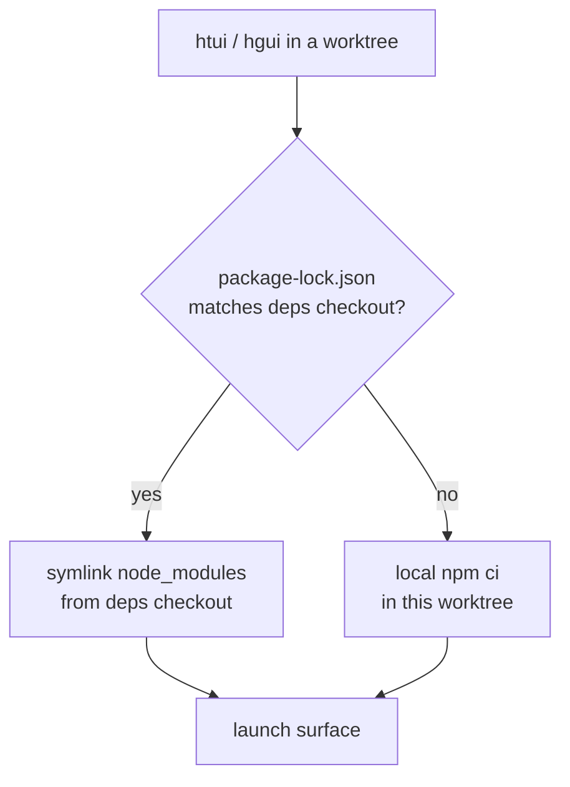

# TUI e Desktop a partir de Worktrees

O núcleo em Python roda sem problemas a partir de qualquer [git worktree](../user-guide/git-worktrees.md) — basta dar `cd` e o `work4you` simplesmente funciona. As duas superfícies em TypeScript não: `ui-tui/` e `apps/desktop/` precisam cada uma de um `node_modules` populado, e um `npm ci` do zero por worktree é lento e duplica gigabytes em cada branch que você tem em checkout.

`htui` e `hgui` são dois helpers de shell que fecham essa lacuna. Cada um lança sua superfície **a partir do worktree atual** enquanto toma emprestado o `node_modules` de um checkout canônico — assim, uma branch descartável custa um symlink, não uma instalação.

São conveniências de desenvolvedor, não comandos distribuídos oficialmente. Coloque-os no seu `~/.zshrc`; adapte os caminhos ao seu gosto.

## O modelo de compartilhamento de dependências

Um checkout é o **checkout de dependências** — o único lugar onde você de fato roda `npm install`. Todo outro worktree se vincula a ele, e só reinstala localmente quando seu lockfile diverge (uma branch que atualiza uma dependência não deve rodar silenciosamente contra pacotes desatualizados).



Duas variáveis de ambiente nomeiam o checkout canônico:

| Variável | Significado |
|----------|-------------|
| `WORK4YOU_MAIN_CHECKOUT` | O checkout de dependências — onde o `node_modules` realmente vive, e cujo `.venv/bin/python` executa o backend. |
| `WORK4YOU_GUI_DEPS_CHECKOUT` | Onde vivem as dependências do desktop (`apps/desktop/node_modules`). Assume `WORK4YOU_MAIN_CHECKOUT` como padrão; sobrescreva apenas se você mantiver as dependências do desktop em outro lugar. |

Nenhuma delas é lida pelo próprio Work4You — são privadas a esses helpers. As variáveis que o Work4You *de fato* lê estão cobertas em [Environment Variables](../reference/environment-variables.md).

## `htui` — TUI a partir do worktree

A TUI em Ink já tem um caminho de desenvolvimento: `work4you --tui --dev` roda as fontes TypeScript via `tsx` em vez do bundle pré-compilado. `htui` é uma linha única em cima disso que também aponta a execução para o `ui-tui/` do worktree atual:

```bash
htui() {
  local root
  root="$(_work4you_root)" || { echo "htui: not in a Work4You checkout" >&2; return 1; }
  ( cd "$root" && PYTHONPATH="$root" \
      "$WORK4YOU_MAIN_CHECKOUT/.venv/bin/python" -m work4you_cli.main --tui --dev "$@" )
}
```

`--dev` compila a partir do código-fonte, então ele vincula `ui-tui/node_modules` de `WORK4YOU_MAIN_CHECKOUT` quando o lockfile raiz corresponde, e instala localmente caso contrário (veja [`_work4you_root` / linking helpers](#shared-helpers)).

:::warning `--dev` e `WORK4YOU_TUI_DIR` são mutuamente exclusivos
`WORK4YOU_TUI_DIR` aponta o Work4You para um bundle *pré-compilado* (Nix, pacotes de sistema), que não tem código-fonte para hot-reload. Se estiver definida no seu shell, `work4you --tui --dev` sai com um erro. Execute `unset WORK4YOU_TUI_DIR` antes de `htui`.
:::

## `hgui` — aplicativo desktop a partir do worktree

O aplicativo desktop é mais pesado: precisa de `node_modules` tanto na raiz do repositório quanto em `apps/desktop/`, um servidor de desenvolvimento Vite fixado na porta `5174` e um backend Python. `hgui` conecta tudo isso ao worktree atual:

```bash
hgui() {
  local root deps desktop
  root="$(_work4you_root)" || { echo "hgui: not in a Work4You checkout" >&2; return 1; }
  deps="${WORK4YOU_GUI_DEPS_CHECKOUT:-$WORK4YOU_MAIN_CHECKOUT}"
  desktop="$root/apps/desktop"

  # Borrow deps when locks match; otherwise install locally in the worktree.
  if cmp -s "$root/package-lock.json" "$deps/package-lock.json"; then
    _work4you_link_deps "$desktop" "$deps/apps/desktop"
    _work4you_link_deps "$root" "$deps"
  else
    ( cd "$root" && npm ci ) || return 1
  fi

  # Vite is fixed at 5174 — evict a stale session from another hgui.
  lsof -t -i:5174 >/dev/null 2>&1 && killport 5174

  # Electron often survives Ctrl+C without reaping its ephemeral backends.
  trap '_work4you_gui_cleanup "$root"' INT TERM EXIT

  ( cd "$desktop"
    export PATH="$root/node_modules/.bin:$PATH"
    WORK4YOU_DESKTOP_WORK4YOU_ROOT="$root" \
    WORK4YOU_DESKTOP_PYTHON="$WORK4YOU_MAIN_CHECKOUT/.venv/bin/python" \
    WORK4YOU_DESKTOP_IGNORE_EXISTING=1 \
    WORK4YOU_DESKTOP_CWD="$root" \
    npm run dev )
}
```

As variáveis de ambiente do desktop que ele define são todas controles reais de resolução de backend:

| Variável | Papel em `hgui` |
|----------|----------------|
| `WORK4YOU_DESKTOP_WORK4YOU_ROOT` | Executa o backend a partir **deste worktree**, não o `work4you` empacotado/do PATH. |
| `WORK4YOU_DESKTOP_PYTHON` | Reutiliza o venv do checkout de dependências em vez de resolver um Python novamente. |
| `WORK4YOU_DESKTOP_IGNORE_EXISTING` | Ignora qualquer `work4you` no `PATH` para que não possa ofuscar o worktree. |
| `WORK4YOU_DESKTOP_CWD` | Abre o chat do desktop enraizado no worktree. |

Duas armadilhas que `hgui` trata e que um `npm run dev` simples não trata:

- **A porta `5174` é fixa.** Um segundo `hgui` colide com o servidor Vite do primeiro; o helper mata o antigo primeiro.
- **Processos filhos órfãos.** O Electron frequentemente sobrevive ao `Ctrl+C` através do `concurrently` sem coletar o backend efêmero `dashboard --port 0` ou o processo Vite. O trap `EXIT`/`INT`/`TERM` executa uma limpeza que encerra o shell do Electron, o listener em `:5174` e qualquer dashboard `--port 0` que ele tenha gerado.

## Helpers compartilhados

Ambas as funções resolvem o checkout envolvente e vinculam as dependências da mesma forma:

```bash
# The enclosing worktree, verified as a real Work4You checkout.
_work4you_root() {
  local root
  root="$(git rev-parse --show-toplevel 2>/dev/null)" || return 1
  [[ -f "$root/work4you_cli/main.py" && -d "$root/ui-tui" ]] && print -r "$root"
}

# Symlink node_modules from the deps checkout — never over an existing tree.
_work4you_link_deps() {
  local target="${1%/}" source="${2%/}"
  [[ -d "$source/node_modules" ]] || return 1
  [[ -e "$target/node_modules" ]] || ln -s "$source/node_modules" "$target/node_modules"
}

# Reap ephemeral backends Electron leaves behind on exit.
_work4you_gui_cleanup() {
  local root="$1"
  [[ -n "$root" ]] && pkill -TERM -f "${root}/apps/desktop/node_modules/electron" 2>/dev/null
  lsof -t -i:5174 >/dev/null 2>&1 && killport 5174
  pgrep -f 'work4you_cli\.main.*dashboard.*--port 0' 2>/dev/null | xargs -r kill -TERM 2>/dev/null
}
```

`killport` é um pequeno helper seu (`lsof -ti:$1 | xargs kill`); substitua pela sua invocação preferida.

:::info Por que vincular apenas quando os lockfiles coincidem
Um symlink para um `node_modules` divergente é pior do que nenhuma instalação — o worktree construiria contra pacotes que seu próprio lockfile nunca declarou. Comparar `package-lock.json` byte a byte é a garantia barata e exata: mesmo lock ⇒ seguro tomar emprestado; lock diferente ⇒ `npm ci` local. O Vite resolve os caminhos reais (realpath) de symlinks antes de aplicar `server.fs.allow`, e é por isso que `apps/desktop/vite.config.ts` inclui na whitelist a localização real do `node_modules`.
:::

## Veja também

- [Git Worktrees](../user-guide/git-worktrees.md) — o modelo de isolamento sobre o qual esses helpers são construídos
- [TUI](../user-guide/tui.md) — `work4you --tui --dev` e o caminho de pré-compilação `WORK4YOU_TUI_DIR`
- [Desktop App](../user-guide/desktop.md) — compilando a partir do código-fonte e a escada de resolução de backend
- [`apps/desktop/README.md`](https://github.com/Leow4u/FORK-56/blob/main/apps/desktop/README.md) — servidor de desenvolvimento, script de sandbox e empacotamento
- [Environment Variables](../reference/environment-variables.md) — todas as variáveis `WORK4YOU_*` que o Work4You lê
